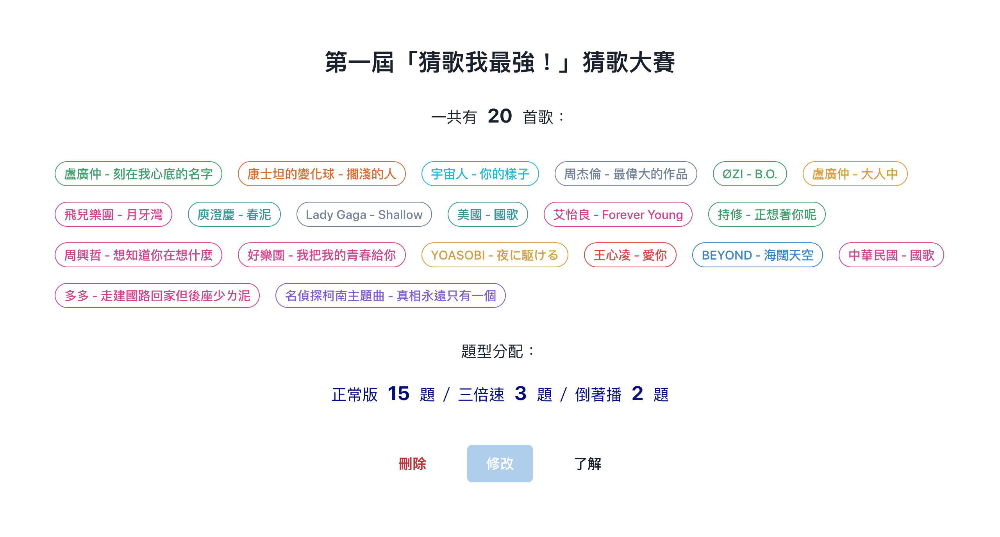
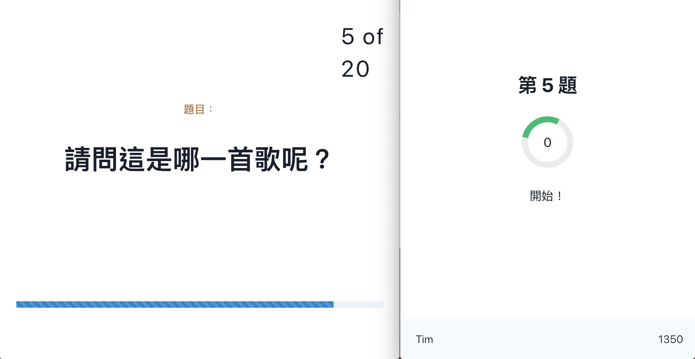
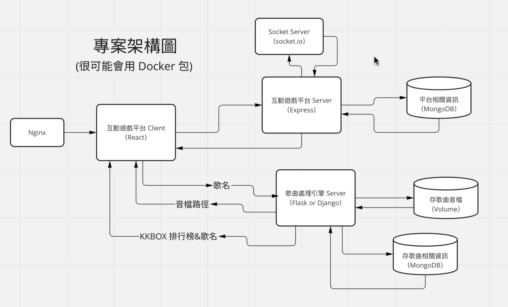
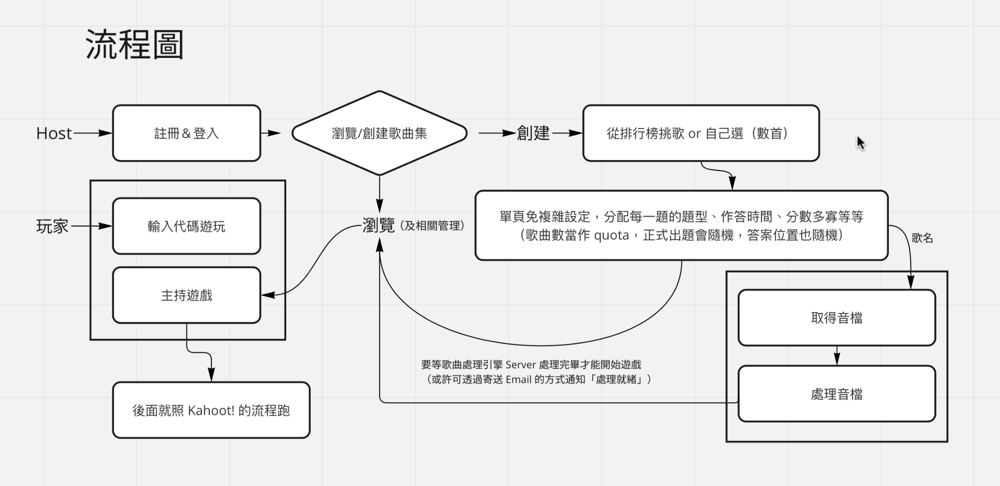
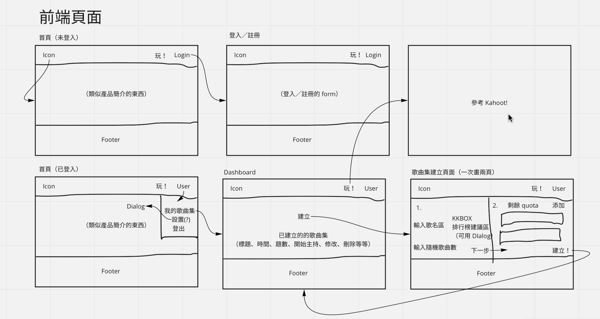
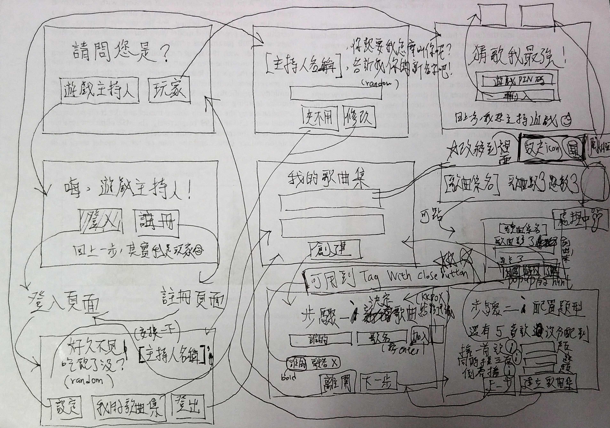
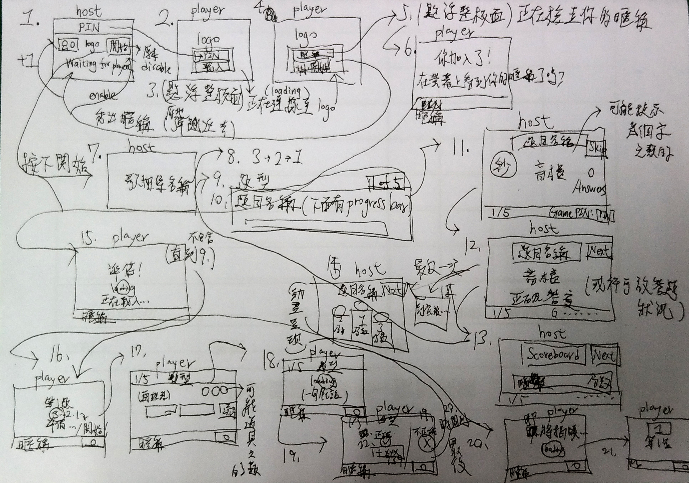
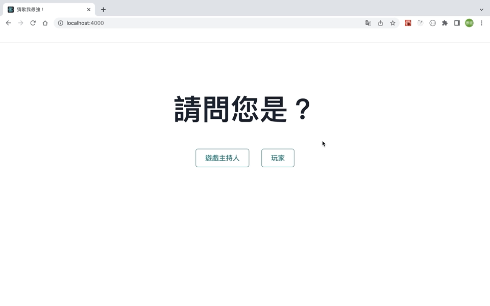
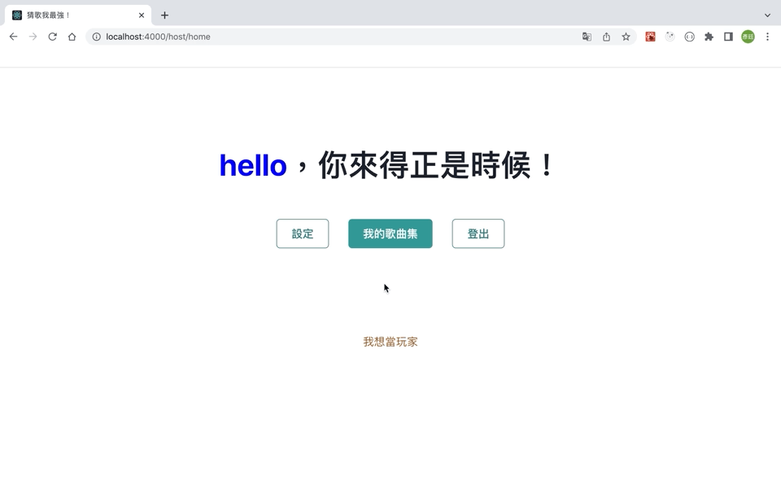
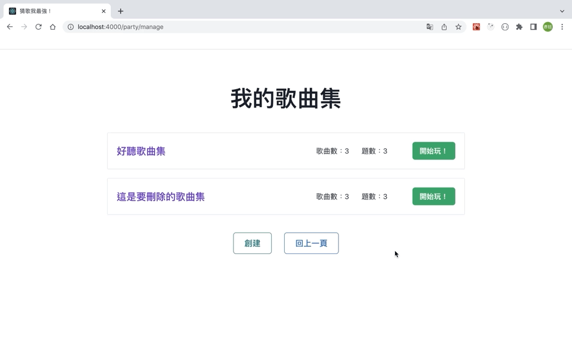

# Guess Songs King

Step 1. Ready Songs            |  Step 2. Play The Game! 
:-------------------------:|:-------------------------:
  |  

<p align=center>
    <a target="_blank" href="https://opensource.org/licenses/MIT" title="License: MIT"></a>
    <a target="_blank" href="http://makeapullrequest.com" title="PRs Welcome"></a>
</p>

An interactive game platform deployed on **AWS EC2** combines the concepts of "Kahoot!" and "song guessing".

## Planning Before Programming
It helps me to be more focused and productive when programming!
The reason is: I don't need to do too much context switching between planning and programming during the process.

**<mark>↓  Click triangles on the left to toggle the images</mark>**
<details>
<summary>Project Architecture Diagram</summary>
<br>

</details>

<details>
<summary>Flow Chart</summary>
<br>

</details>

<details>
<summary>Front-End Page Design</summary>
<br>

<br>

<br>

</details>

## Features
**<mark>↓  Click triangles on the left to toggle the demo GIFs</mark>**
<details open>
<summary>Game host registers on the platform</summary>
<br>

</details>

<details open>
<summary>Game host creates a song-guessing party and then song audio files process in the background</summary>
<br>

</details>

<details open>
<summary>Game host deletes a song-guessing party and sees the detail of another</summary>
<br>

</details>

<details open>
<summary>Game host hosts a game and players join the game to play (just like Kahoot!)</summary>
<br>

</details>

## Powered by

- **Back-End:** Node.js, Express, Flask, NGINX
- **Front-End:** React, Chakra UI, SweetAlert2
- **Database:** MySQL
- **Cloud Service:** AWS EC2
- **Third-Party API:** KKBOX OpenAPI
- **Open Source Tools** Socket.IO

## How to Run

### Beforehand
```bash
brew install ffmpeg
brew install libsndfile   # for librosa

# And add the following to .zshrc or the equivalent
# https://stackoverflow.com/questions/70737503/macos-brew-install-libsndfile-but-still-not-found
export CPATH=/opt/homebrew/include
export LIBRARY_PATH=/opt/homebrew/lib

# still failed, new workaround: https://stackoverflow.com/a/68976159 --> ✅
```

### DB Initialization
```bash
sh ./init.sh
```

### Front-End
```bash
cd frontend/
npm install
npm start
```

### Audio Processor
```bash
cd song-processor/
pipenv shell
pipenv install
flask run --host=0.0.0.0
```

### Back-End
```bash
cd backend/
npm install
nodemon bin/www
```